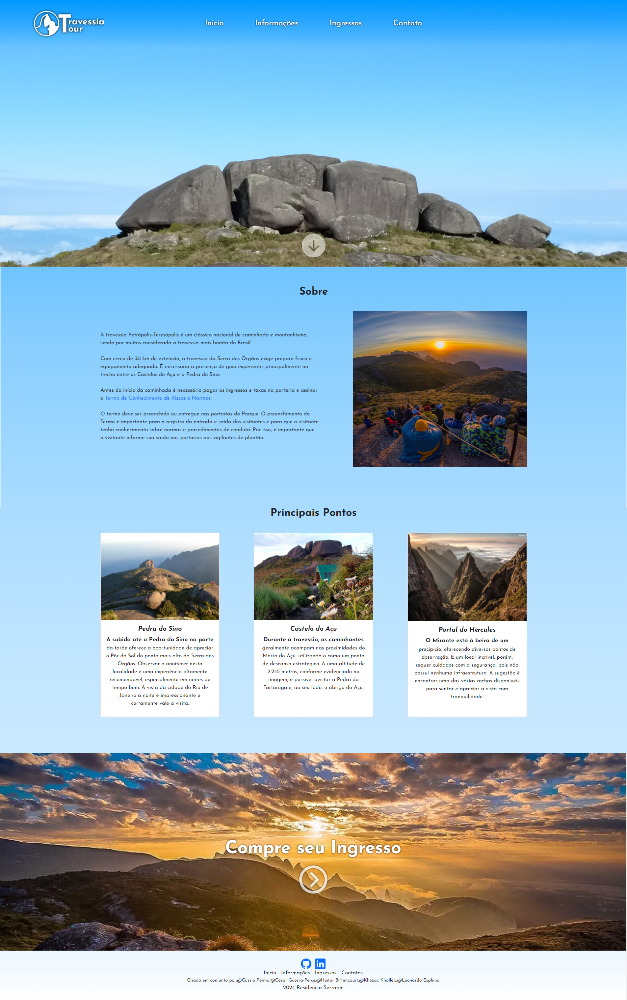
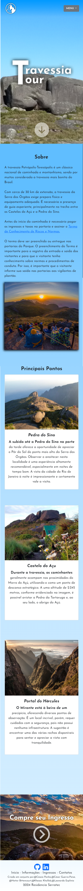

# Projeto TravessiaTour

Este projeto foi criado em grupo com o intuito de aprendizado enquanto residentes na Residência em TIC/Software da Serratec.

Integrantes do grupo responsável:

- <a href="https://github.com/cassio-penha" target="_blank">Cássio Penha</a>
- <a href="https://github.com/CesarGuerraPeixe" target="_blank">César Guerra-Peixe</a>
- <a href="https://github.com/hei-bittencourt" target="_blank">Heitor Bittencourt</a>
- <a href="https://github.com/Khezac" target="_blank">Khezac Khalleb</a>
- <a href="https://github.com/LeoEsplinio" target="_blank">Leonardo Esplíneo</a>

## Sobre oque é o projeto?

Criamos, nessa aplicação Front-end, um website que mostra um pouco a Travessia Petrópolis x Teresópolis, representado por diversas imagens e mencionando variadas informações de grande importância, possibilitando também marcar um agendamento de passeio na mesma.

    <figure style="text-align:center; flex:6;">
        <figcaption styles="text-align: center;">Desktop</figcaption>
        
    </figure>
    <figure style="text-align:center; flex:1;">
        <figcaption styles="text-align: center;">Mobile</figcaption>
        
    </figure>

## Informações técnicas do projeto:

- O design do projeto foi inicialmente planejado utilizando o figma:
  - Link do figma:
    <a href="https://www.figma.com/file/4gd4trO8pNFapEcGUjJqYN/Trabalho-Front-End-Serratec?type=design&node-id=0%3A1&mode=design&t=uhUYIiikG9x3YNbC-1" target="_blank">
    /TravessiaTour
    </a>
- Tecnologias utilizadas:
    -  HTML
    -  CSS
    -  JavaScript
- Este projeto também conta com o consumo de uma fake API:
    - mockAPI
